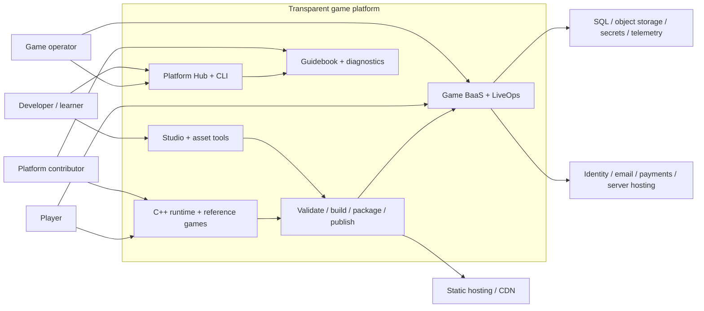
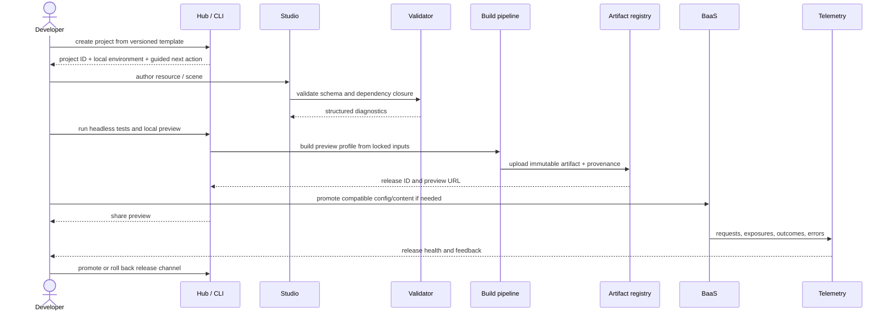
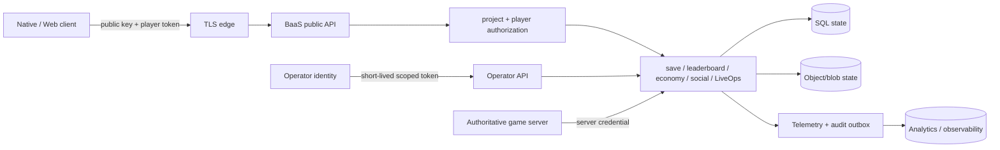

# Target Platform Architecture

**Architecture horizon:** 2026–2029
**Status:** Strategic target; individual decisions require ADRs before implementation
**Primary quality:** One reproducible, inspectable path from project creation to an
observable release.

## Architecture objective

Connect the current engine, authoring tools, WebAssembly build, Game BaaS, and
guidebook through a small platform spine. Preserve the boundaries that already make
the repository portable and testable. Add production adapters without making the
learning path depend on a cloud account.

The target is not a single giant editor process and not a microservice fleet. It is a
set of replaceable layers with one versioned project contract and one command contract.

## System context



### Actors

- **Developer/learner:** creates a project, authors content, writes game logic, runs
  tests, publishes previews, and reads explanations/diagnostics.
- **Game operator:** promotes releases, changes LiveOps configuration, investigates
  incidents, restores data, and manages player/support actions.
- **Player:** runs a native or browser client and calls the public game-service plane.
- **Platform contributor:** changes engine/platform behavior, migrations, tools, and
  documentation under compatibility and test contracts.

One person may hold all roles locally. Their credentials and authorities must still
remain distinct because local convenience must not define production trust.

## Six product layers

### 1. Platform spine

Owns the product-level contract rather than engine internals:

- project discovery and `game.project` manifest;
- CLI command contract;
- Platform Hub information architecture;
- tool/runtime version compatibility;
- environments and release channels;
- local workspace state and diagnostics;
- links to guidebook, preview, and operations.

The Hub is a client of the CLI/domain services. GUI actions must not contain unique
build, migration, or publish logic that CI cannot reproduce.

### 2. Studio and content

Owns resources and authoring sessions:

- resource IDs, types, schema versions, source path, generated artifacts, dependencies,
  validation status, and content hash;
- shared document lifecycle: open, dirty, undo/redo, autosave, recover, validate,
  save, migrate, package;
- specialized editors such as Texture Lab, Map Lab, scene composer, prefab inspector,
  animation editor, and asset browser;
- exact packaged preview and failure diagnostics.

Studio does not own runtime simulation rules or deployment credentials.

### 3. Runtime and reference games

Owns deterministic game execution:

- `Scene`/fixed-timestep application contract;
- engine systems and render/audio/input backends;
- resource loading through the registry and `assets::` seam;
- native and WebAssembly execution;
- headless simulation tests;
- versioned reference-game behavior and performance budgets.

Runtime code does not call deployment services or embed backend implementation
dependencies.

### 4. Build, artifact, and release pipeline

Owns transformation and release state:

- validation and dependency closure;
- native/Web build profiles;
- deterministic package manifest;
- checksums, provenance, size/performance budgets, and compatibility metadata;
- immutable artifact upload;
- development, preview, and production channels;
- promotion and rollback history.

It does not mutate an existing release. A correction produces a new immutable release
or repoints a channel to a previously verified release.

### 5. Game BaaS and LiveOps

Owns game-facing online state and operator control:

- project/player identity and authorization;
- saves, leaderboards, catalog/economy, configuration, events, experiments, analytics,
  social/trust, replay, and multiplayer coordination;
- operator APIs, audit records, migrations, backup/restore, and service health;
- SDK contract and provider adapters.

BaaS remains a separate process/binary. Game/engine code calls it over versioned
protocols and never links Drogon, SQL, or provider SDKs.

### 6. Learning and operations knowledge

Owns explanation and response:

- guidebook concept paths and exercises;
- architecture decisions and compatibility notes;
- generated API/reference material;
- error catalog and diagnostics links;
- deployment, backup, restore, rollback, and incident runbooks;
- maturity and support labels.

Documentation is an interface. Changes that invalidate a supported procedure are
compatibility changes even when APIs remain identical.

## Canonical project contract

The future `game.project` manifest is the root of all product actions. The exact
serialization needs an ADR, but its semantic contract is fixed here.

```text
Project identity
  id, display name, project schema version

Compatibility
  required platform version, API version, resource schema set

Runtime
  entry scene, tick policy, supported input profiles

Resources
  source roots, registry path, generated output, package rules

Build profiles
  development, preview, release; native/web targets and budgets

Online services
  local/preview/production environment references; no embedded secrets

Telemetry
  event schema version, consent/default policy, sampling profile

Distribution
  package metadata and external export presets
```

Rules:

1. The manifest is versioned and migratable.
2. Secrets are referenced, never committed into it.
3. All paths are project-relative or resource IDs.
4. Unknown required fields fail with an actionable compatibility error.
5. A release embeds the normalized manifest and dependency lock used to build it.
6. GUI and CLI read the same model.

## Golden-path sequence



Every arrow requires an error contract. “Open the build directory and fix it” is not
a supported product action.

## Core flows

### Control flow

The Hub or CI invokes the CLI. The CLI parses `game.project`, resolves the platform
version, and calls focused domain commands:

```text
project create | inspect | migrate
asset validate | migrate | package
test headless | integration | browser
build development | preview | release
release publish | inspect | promote | rollback
service local-up | migrate | backup | restore | doctor
```

Names are illustrative until a CLI ADR, but the separation is normative. Commands
return structured status and diagnostic codes so the GUI, CI, and guidebook can point
to the same resolution.

### Content flow

1. A source resource is created/imported in Studio.
2. The registry assigns or resolves its stable ID and schema version.
3. Validation emits diagnostics without modifying valid input.
4. Generation produces cacheable derived artifacts keyed by tool version, input hash,
   and build profile.
5. Packaging walks the dependency graph from entry scenes.
6. The package manifest records every resource ID, content hash, and license metadata.
7. Publishing stores the package immutably; channels reference release IDs.

Changing a source file never silently changes a published release.

### Player data flow



Public client, player, game server, project operator, and platform administrator are
separate principals. A credential valid in one trust domain cannot be “upgraded” by
adding a header.

### LiveOps and experiment flow

1. Operator creates a versioned draft configuration or experiment.
2. Validation checks schema, audience definition, schedule, conflicts, and guardrails.
3. Approval records actor, diff, reason, and rollback target.
4. Publishing creates an immutable LiveOps version.
5. Player evaluation records an exposure event with project, user, experiment,
   variant, release, and schema versions.
6. Outcome events join only through governed identifiers.
7. Dashboards show data-quality warnings before causal interpretation.
8. Stop/rollback takes effect through a new version and remains auditable.

### Backup and restore flow

Backups are not complete when bytes are copied. The supported flow is:

1. record database/schema/application version and object-store manifest;
2. create encrypted backup with retention class;
3. verify checksum and restore eligibility;
4. restore into an isolated environment on schedule;
5. run integrity and golden-path smoke tests;
6. record recovery point objective (RPO) and measured recovery time (RTO);
7. expire data under the documented policy.

## Preserve existing seams

### `platform.hpp`

Keep SDL and browser/platform lifecycle behind the existing platform interface. Add
capabilities through small data types and capability queries; do not expose native
handles above the boundary unless an explicit optional extension owns them.

### Fixed tick and `Scene`

Keep deterministic updates separate from rendering and external callbacks. Network,
asset, and platform events are pumped into snapshots/queues. Authoritative simulation
and replay depend on this invariant.

### `assets::`

All runtime file/resource access remains behind the asset seam. The resource registry
resolves logical IDs and packages; it does not license arbitrary direct filesystem
access throughout engine/game code.

### SDL-free core libraries

Continue separating pure data/algorithms from scenes and I/O. New resource, animation,
economy rule, and experiment-assignment cores should be headless-testable.

### `ITransport` and `IWsTransport`

Preserve HTTP/WS transport independence and non-blocking `Client::update()`. Add
cancellation, retry policy, request IDs, refresh/session behavior, and telemetry at
the SDK layer without leaking libcurl or browser types.

### Separate BaaS process

Preserve the strongest backend rule: the game calls the service and never links it.
The modular monolith remains appropriate until observed scale or ownership requires a
service extraction. Extraction requires an ADR and data/operating owner.

## New boundaries

### Resource registry

Contract: `ResourceId + ResourceType + SchemaVersion -> metadata + source/derived
locations + dependencies + content hash`. It must work in a local directory and with a
remote object store through adapters.

### `RenderDevice`

Contract: create/update/destroy render resources; submit frame commands; report
capabilities and timings. The software renderer remains one backend/reference oracle.
OpenGL ES 3/WebGL2 is the lower-friction first accelerated backend **for a hand-written
engine** — Emscripten maps a GLES2/3 subset straight onto WebGL1/2, so the binding
surface is small and battle-tested, and WebGL2 still reaches the browsers WebGPU does
not (as of mid-2026, Firefox on Linux/Android/Intel Macs). WebGPU is now a **co-equal**
option rather than a distant one — by 2026 it is the framework default for new web
projects (Unity 7, Three.js, Babylon.js all ship WebGPU-with-WebGL2-fallback) — and is
a reasonable starting point if you accept a WebGL2 fallback and the larger hand-written
binding surface. Choose by measured need against a stable resource/material model, not
by "modern" branding.

### API contract

OpenAPI (and a separate event-schema contract) becomes canonical for routes, payloads,
errors, authentication, pagination, idempotency, and versions. Controllers and SDKs
must pass contract tests; generated code may be wrapped by idiomatic hand-written SDKs.

### Artifact store

Contract: immutable release ID -> manifest, files, checksums, provenance, compatibility,
creation actor/time, and promotion history. Local filesystem and object storage are
adapters. Channels are mutable references with audited compare-and-set updates.

### Environment and secret provider

Project configuration names environments. Secret values come from local ignored files
or an external secret manager. The same configuration schema applies; production
secrets never depend on developer dotfiles.

### Dedicated-server provider adapter

Contract: publish server build, allocate session with placement constraints, receive
health/readiness, drain, terminate, and report cost/region/session metadata. The BaaS
owns game-session intent; GameLift, Edgegap, Agones, or another system owns fleet
orchestration.

## Trust zones and authorities

| Principal | Allowed | Explicitly forbidden |
|---|---|---|
| Anonymous client | Bootstrap, public config/content, guest auth | Admin changes, server-authoritative grants |
| Player | Own saves/profile/inventory actions permitted by rules | Other users' data, raw grants, project configuration |
| Game server | Validate match results, server-side transactions for assigned sessions | Platform administration, unrelated projects |
| Project operator | Project config, releases, support actions by role | Platform-global secret or other projects |
| Platform administrator | Provision/disable projects, platform policy | Routine use for normal game operations |
| Build publisher | Upload signed artifacts for allowed project/channel | Read player private data or mutate economy |

Requirements:

- short-lived scoped credentials where practical;
- rotation and revocation without redeploying all clients;
- audit actor, action, target, before/after or hash, reason, request/trace ID, time;
- no secrets in project manifests, Web packages, logs, analytics, or crash reports;
- explicit rate and abuse boundaries per public operation;
- data export/deletion and retention ownership before external beta.

## Compatibility and versioning

The platform has multiple independently changing contracts:

| Contract | Version unit | Compatibility policy |
|---|---|---|
| Platform CLI/project | manifest schema + platform release | migrator supports documented previous versions; unknown required version fails |
| Resource | type schema + generator version | migration is explicit; release embeds normalized version/hash |
| Runtime ABI/API | platform release | reference games build in CI; breaking change requires migration guide |
| BaaS HTTP/WS | major API version + additive schema evolution | old supported major has sunset window and telemetry |
| SDK | semantic version | contract suite tests supported API/SDK matrix |
| Analytics events | event schema version | warehouse/queries preserve meaning across versions |
| Release artifact | immutable release ID | never changed; channel promotion is audited |

“Latest” may be a UI convenience but is never sufficient release provenance.

## Failure behavior

- **Manifest incompatible:** stop before build, show required/current versions and
  migration command.
- **Resource invalid:** preserve source, reject package closure, link diagnostic to
  Studio field and guidebook explanation.
- **Build non-reproducible:** fail release profile when input lock/provenance differs;
  development profile may warn.
- **Publish interrupted:** an incomplete upload never becomes a channel target;
  content-addressed retry is safe.
- **BaaS unavailable:** SDK returns typed transient errors, applies bounded backoff,
  and never blocks the game tick; offline-safe actions are explicitly modeled.
- **Migration failed:** transaction/expand-contract policy preserves the last
  supported application version; deployment does not continue blindly.
- **Telemetry unavailable:** gameplay availability policy is explicit; audit/security
  events have a durable outbox when required.
- **LiveOps bad outcome:** operator can stop assignment and repoint config/release to
  the verified predecessor with a recorded reason.

## Build versus integrate

| Area | Own/build | Integrate |
|---|---|---|
| Engine | deterministic core, reference renderer, resource/render seams | OS/GPU APIs, codecs when their internals are not the lesson |
| Studio | document lifecycle, asset graph, exact preview, diagnostics | native file dialogs, image/audio import libraries after format ADR |
| Delivery | manifest, provenance, channel/promotion/rollback domain | CI runner, registry, CDN, signing/notary services |
| BaaS | game-domain rules, local adapter, API/event contracts | SQL/object stores, secret manager, email, payments, platform identity |
| Multiplayer | deterministic game server protocol and provider seam | fleet scheduling, global placement, voice, anti-cheat |
| Observability | semantic events, trace context, SLO definitions | metrics/log/trace storage, alert transport |
| Distribution | export presets and release metadata | itch.io, Steam, app stores, public payment rails |

## Quality attributes and acceptance rules

### Portability

- Supported code builds in a clean CI environment for the declared matrix.
- Web differences live behind named seams and capability checks.
- Unsupported capabilities fail at validation, not after publishing.

### Determinism

- Simulation and procedural content accept explicit seeds/time/input.
- Replay tests compare authoritative state checkpoints, not only command parsing.
- Derived assets record tool version and input hash.

### Security

- Threat model for every new trust boundary.
- Dependency/license inventory and security update owner.
- Secrets scanning, least privilege, rotation, audit, and abuse controls.
- Economy operations are atomic, idempotent, authorized, and ledgered.

### Recoverability

- Release and config rollback are tested.
- Data restore is exercised, timed, and integrity-checked.
- Migration declares compatible application window and rollback/forward-fix policy.

### Observability

- Every external request carries correlation/trace context.
- Release, project, environment, route, result class, and latency are queryable.
- Golden-path synthetic checks distinguish build, hosting, BaaS, and browser failures.

### Performance

- Build size/time and runtime frame/memory/network budgets live in build profiles.
- Reference games publish baseline and regression thresholds.
- Optimization follows measured bottlenecks; no backend choice is justified by scale
  that has not been observed.

### Operability

- Local and production procedures use the same domain commands and config schema.
- `doctor` output identifies version, dependency, environment, connection, and
  permission failures without requiring source reading.
- Every externally supported capability has an owner, runbook, and deprecation path.

## Architecture decisions required before implementation

1. Project manifest serialization, schema evolution, and workspace layout.
2. Resource ID model, registry storage, package manifest, and migration strategy.
3. CLI command/diagnostic contract and Hub-to-CLI boundary.
4. API contract/version/error/idempotency conventions.
5. Build provenance, artifact identity, channels, promotion, and rollback.
6. PostgreSQL/local repository interface and migration tool.
7. Operator identity, RBAC, secret provider, and audit schema.
8. Telemetry schema, trace propagation, retention, and privacy model.
9. `RenderDevice` resource/command model and first accelerated backend.
10. Dedicated-server provider seam when a selected reference game requires it.

These ADRs should be made in dependency order. Selecting WebGPU or Kubernetes before
project/resource/release contracts would optimize a component before defining the
product.

## Architecture non-goals

- Do not merge engine, Hub, BaaS, and build pipeline into one process.
- Do not decompose the BaaS into network microservices without observed scaling or
  ownership pressure.
- Do not require cloud access for creation, validation, local play, or learning.
- Do not expose raw filesystem paths or provider credentials as stable public APIs.
- Do not promise seamless compatibility across unlimited platform/tool versions.
- Do not build public discovery, payments, moderation, or creator payouts inside the
  private artifact registry.
- Do not remove the software renderer or simple local adapters merely because a
  production adapter exists.

## Architectural success condition

The architecture succeeds when a developer can understand each boundary independently,
replace a provider without rewriting game logic, reproduce a release from locked
inputs, recover from a failed change, and trace player-visible behavior back through
release, content, configuration, service, and documentation versions.
