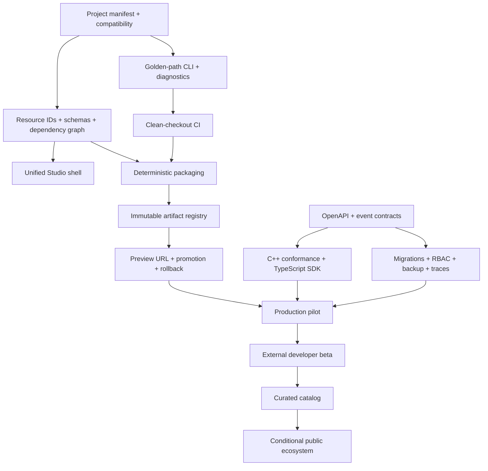

# Outcome-Gated Roadmap 2026–2029

**Roadmap date:** 2026-07-11
**Planning model:** five horizons with evidence-based exit gates
**Capacity assumption:** one primary maintainer or a small team; one main vertical
slice at a time.

## How to read this roadmap

The time windows are planning horizons, not delivery promises. A horizon ends when
its outcome is demonstrated, not when its calendar expires. If an exit gate fails,
the next horizon does not begin by relabeling unfinished work.

The roadmap deliberately favors connections among existing capabilities over new
subsystem breadth. Each horizon must produce a usable and testable improvement to the
canonical loop:

> **new project → create → test → publish → operate → learn**

## Adopted execution posture — _blend_ (2026-07-11)

The owner adopted this roadmap as a **map, not a schedule**, with a deliberately modest
near-term cadence for a solo maintainer whose primary goal remains learning:

- **One reference game, one thin golden path first.** Horizon 0's manifest → CLI →
  single-project golden path is the next real work, so the accumulated subsystems can be
  created/tested/packaged/previewed as *one project* instead of a dozen `--flag` scenes.
- **Interleave to keep momentum.** Each cycle pairs one golden-path/plumbing slice with
  one hand-written runtime or learning slice (renderer, animation, audio, netcode…), so
  the least-fun product plumbing never fully crowds out the deep-dive work that sustains
  a solo project. The plumbing rides *alongside* the fun, no longer instead of it.
- **Later horizons are conditional, not committed.** Full production hardening
  (Horizon 2), external developer beta (Horizon 3), and any curated catalog (Horizon 4)
  stay gated on the evidence each already requires. They are not a promised multi-year
  march, and none should pull work forward before its trigger metric is met.
- **What this de-scopes now:** the three-game portfolio shrinks to **one** to start
  (see below); the ops-heavy build-out (Postgres/RBAC/audit/backup/SLO/LiveOps) is
  something to *learn once when a reference game needs it*, and to *integrate* rather
  than hand-build where the strategy already says so.

This posture changes sequencing and emphasis, not the category, the seams, or the gates.

## Roadmap rules

1. One reference game owns the primary proof for each horizon.
2. Every initiative has an explicit dependency, outcome, and non-goal.
3. A GUI action must have a reproducible command/domain equivalent.
4. A “production” claim requires migration, security, observability, backup/restore,
   rollback, and operating ownership evidence.
5. Platform breadth does not advance a horizon unless the golden path uses it.
6. Conditional bets begin only after their trigger metric is met.
7. Maintenance and documentation capacity are reserved in each horizon.
8. Security or data-loss risk may interrupt planned feature work.

## Workstreams

| Workstream | Long-term outcome | Near-term posture |
|---|---|---|
| Platform spine | One project/command/release contract across all surfaces | Highest priority |
| Engine/runtime | Focused, deterministic runtime with reference and accelerated paths | Driven by reference games |
| Studio/content | Unified resource-aware authoring and exact packaged preview | Connect existing tools first |
| BaaS/LiveOps | Self-hostable local path plus production adapters and safe operations | Harden before expanding |
| Delivery/operations | Reproducible builds, immutable releases, rollback, and recovery | Begin immediately |
| Learning/ecosystem | Journey-based learning and evidence-led external adoption | Continuous; ecosystem conditional |

## Dependency spine



The dependency spine is more important than a date. For example, a Hub cannot safely
hide manual steps before project/resource/command contracts exist, and public
publishing cannot precede release rollback and trust operations.

## Reference-game portfolio

Three maintained reference games should *eventually* replace a growing undifferentiated
demo list as platform acceptance — but under the adopted blend posture, **start with
one** (the Creator game, which reuses the FPS + Texture/Map Lab work already built) and
promote a second only after the first proves the full loop. Maintaining three product
contracts at once is too heavy a standing tax for a solo maintainer:

| Reference game | Journey proved | Candidate baseline |
|---|---|---|
| **Creator game** | Studio assets/maps → deterministic package → browser preview | FPS + Map/Texture Lab |
| **Connected game** | Auth/save/inventory/config/events/replay → observable release | Colony |
| **Social game** | Lobby/matchmaking/presence → authoritative or validated outcome → operations | Chess or a small co-op/competitive sample |

The exact game can change through an ADR. The journey cannot. Historical demos remain
learning chapters but need not all become supported product templates.

---

## Horizon 0 — Make it one product

**Target window:** 0–3 months
**Outcome:** A clean checkout follows one documented command path from project creation
to a native and browser development build.

### Primary vertical slice

Create a versioned project around the creator-game candidate. It references an entry
scene, existing texture/map assets, build profiles, and local BaaS configuration. The
same project is inspected and built by CLI and future Hub clients.

### Platform spine

- Write ADR for project manifest semantics, serialization, schema version, workspace,
  environment references, and migration behavior.
- Create the `game.project` domain model and a read-only `inspect/doctor` flow before
  automation mutates projects.
- Define structured diagnostic codes and documentation links.
- Define CLI command tree and exit/status contract.
- Document platform/runtime/resource/API compatibility policy.

### Engine/runtime

- Select supported reference-game entry scenes and freeze their baseline behavior.
- Define input-profile and headless simulation acceptance for the chosen game.
- Add runtime version/resource compatibility checks to the design before new engine
  features.
- Record initial frame, memory, package-size, and startup baselines without optimizing
  unmeasured bottlenecks.

### Studio/content

- Write ADR for stable resource IDs, resource types, schema versions, dependencies,
  source/derived artifacts, and content hashes.
- Inventory current `.hrt`, recipe, sandbox, save, and map formats.
- Define migration and validation error behavior.
- Specify the shared Studio document lifecycle and asset-browser information model;
  implementation stays in Horizon 1.

### BaaS/LiveOps

- Inventory every HTTP and WebSocket route, payload, error, credential, and tenant rule.
- Establish OpenAPI conventions for HTTP and a companion schema for realtime/events.
- Define API versioning, pagination, idempotency, request/correlation IDs, and typed
  transient/permanent errors.
- Keep service breadth frozen except security/correctness fixes needed by the reference
  game.

### Delivery/operations

- Add clean-checkout CI for the declared macOS/Linux/Windows/Web matrix, beginning with
  runners actually available and documenting unsupported cells.
- Produce build/test artifacts and a machine-readable test summary.
- Define dependency and license inventory, sanitizer cadence, and artifact provenance.
- Define local-stack configuration without committing secrets.

### Learning/ecosystem

- Add a role-based “build your first project” journey linking existing chapters.
- Label reference, functional, and production maturity consistently.
- Add local Markdown link validation and documentation freshness metadata.
- Instrument the time and failures for a clean-checkout golden-path rehearsal.

### Dependencies

- Existing platform/asset/tick boundaries and passing baseline tests.
- A selected creator-game reference journey.
- Agreement that project and resource contracts precede Hub UI implementation.

### Exit gate

Horizon 0 passes only when:

1. a clean checkout can create or instantiate the reference project using documented
   commands;
2. project/resource compatibility is validated before compilation;
3. headless tests, native build, and Web build run through the same named project;
4. CI reproduces the supported subset and publishes provenance/test artifacts;
5. a new developer can complete the documented path without editing `src/main.cpp` or
   `web/shell.html`;
6. median completion time and failure reasons are recorded for at least five internal
   rehearsals.

### Non-goals

- No visual Hub automation beyond validated information architecture/prototype.
- No accelerated renderer.
- No public hosting service.
- No new economy/social backend modules.
- No external SDK promises.

### Main risks

- Overdesigning the manifest before proving one project.
- Hiding existing manual assumptions instead of removing them.
- Declaring a broad CI support matrix without access to representative machines.

---

## Horizon 1 — Create to publish

**Target window:** 3–6 months
**Outcome:** A developer can author a content change, preview the exact package, publish
an immutable Web release, share it, promote it, and roll back in under 15 minutes.

### Primary vertical slice

Author a map and texture for the creator game inside the unified Studio shell, validate
their dependency closure, run the packaged preview, publish to a private preview
channel, and promote/roll back through the release domain.

### Platform spine

- Implement the first Hub shell as a view/controller over project and CLI/domain
  commands: Projects, Create, Test, Build, Releases, Operate, Learn.
- Show version compatibility, last validation, last build, environment, and next
  recommended action.
- Keep command output structured so Hub and CI surface identical diagnostics.

### Engine/runtime

- Add resource-registry lookup while preserving `assets::` as the runtime I/O seam.
- Package only dependency closure from entry scenes.
- Introduce input actions and build-profile budgets needed by browser/native preview.
- Add browser smoke tests for startup, input, asset load, and BaaS bootstrap.

### Studio/content

- Create the shared Studio shell and dock/navigation model.
- Add document dirty state, undo/redo transaction contract, autosave, crash recovery,
  validation panel, thumbnails, metadata, dependency view, and collection search.
- Migrate Texture Lab and Map Lab into the shared shell before adding a new Lab.
- Preview from a temporary package manifest, not directly from arbitrary source paths.

### BaaS/LiveOps

- Generate/validate the HTTP contract and make the C++ SDK pass conformance tests.
- Add correlation IDs, normalized error codes, bounded retry guidance, cancellation
  contract, and version headers.
- Start the TypeScript SDK with auth, config, analytics, and health/diagnostics—the
  minimum needed for Web/Hub integrations.
- Define release/config compatibility and environment separation.

### Delivery/operations

- Define immutable release manifest, content checksums, tool/platform versions,
  provenance, and compatibility metadata.
- Implement local filesystem artifact adapter plus one hosted object/static adapter.
- Create development, preview, and production channel semantics.
- Add atomic channel promotion, audit reason, predecessor, and rollback command.
- Provide itch.io-compatible Web export and document generic static hosting.

### Learning/ecosystem

- Write a complete “author to URL” guide and a failure lab for invalid assets, broken
  package dependencies, incompatible versions, failed uploads, and rollback.
- Record packaging/build/publish duration, artifact size, failure class, and rollback
  time.

### Dependencies

- Horizon 0 manifest, resource identity, CLI, CI, and API conventions.
- A private hosting/object-store adapter chosen by ADR.
- Browser compatibility baseline and package-size budget.

### Exit gate

Horizon 1 passes only when:

1. source asset changes flow through shared Studio lifecycle and validation;
2. local packaged preview and published preview use identical content hashes;
3. publishing is retry-safe and cannot expose a partial release;
4. a preview URL starts successfully on the declared browser matrix;
5. promotion and rollback are audited and each completes within five minutes;
6. five rehearsals achieve a median author-to-share time below 15 minutes;
7. the prior release remains playable after a bad new release is rejected or rolled
   back.

### Non-goals

- No public discovery/catalog.
- No collaborative multi-user editing.
- No persistent browser authoring unless native Studio evidence demands it.
- No advanced GPU material editor.
- No paid hosting product.

### Main risks

- UI work starts before command/resource behavior stabilizes.
- Preview and release profiles diverge.
- An artifact registry quietly becomes an unplanned public marketplace.

---

## Horizon 2 — Operate a real small game

**Target window:** 6–12 months
**Outcome:** Run a limited production pilot for a connected reference game with safe
deployments, reversible LiveOps, governed telemetry, and tested recovery.

### Primary vertical slice

Publish the connected reference game, onboard a controlled player cohort, change one
LiveOps parameter through a versioned segment/experiment, observe health and outcome,
then stop or promote the change. Exercise restore and incident response.

### Platform spine

- Add environment health and compatibility views to Hub/CLI.
- Add operator role-aware actions for releases, LiveOps, players, backups, and incidents.
- Expose service/API/SDK/platform version matrix and upgrade readiness.

### Engine/runtime

- Add 2D animation, audio mixer/spatial controls, material/resource improvements, and
  profiling only where the connected game requires them.
- Write `RenderDevice` ADR and implement the minimal resource/command seam.
- Prototype OpenGL ES 3/WebGL2 acceleration against reference scenes if CPU budgets
  fail; keep the CPU backend as fallback/test oracle.
- Add suspend/resume, offline/transient-error, and reconnect behavior for target devices.

### Studio/content

- Add environment-aware content bundles, validation against runtime/API versions, and
  content promotion/rollback.
- Add prefab/scene composition needed by the connected game.
- Add import/license metadata and package policy for third-party assets.

### BaaS/LiveOps

- Introduce versioned migrations and PostgreSQL production adapter while retaining
  SQLite local mode.
- Add operator identity, project roles, short-lived credentials, rotation, audit log,
  and separated player/server/operator authorities.
- Add encrypted backups, restore verification, retention, privacy export/delete, and
  incident runbooks.
- Add structured logs, metrics, distributed trace context, SLO dashboards, alerts, and
  release/environment dimensions.
- Implement segments, scheduled configuration/events, experiment assignment, exposure
  events, guardrails, and stop/rollback.
- Implement economy foundations only if the connected game requires them: catalog,
  currencies, atomic/idempotent transactions, ledger, and server authority. Integrate
  store receipt validation rather than inventing payment rails.

### Delivery/operations

- Containerize BaaS and document local, preview, and production profiles.
- Add expand/contract deployment sequence and compatible application window.
- Add synthetic golden-path checks and release health gates.
- Set capacity and cost budgets; load-test only the expected pilot envelope.
- Run failure drills: bad migration, BaaS unavailable, telemetry unavailable, object
  loss, expired credential, bad config, and release rollback.

### Learning/ecosystem

- Write operations chapters: tenancy/trust, migration, tracing, SLO, backup/restore,
  experiments, economy invariants, and incident review.
- Publish explicit production-pilot limitations and support expectations.
- Recruit a small controlled player cohort; this is not an open developer beta.

### Dependencies

- Horizon 1 immutable release and rollback.
- API/event contracts and TypeScript SDK baseline.
- Named operator and security/data owners, even if held by one person.
- Hosting budget and data-retention decision.

### Exit gate

Horizon 2 passes only when:

1. a production-like deployment is reproduced from versioned configuration;
2. migration succeeds with documented compatible-version and recovery behavior;
3. backup restore completes in isolation and meets the initial RPO/RTO budget;
4. a bad release and a bad LiveOps change are detected and reversed through runbooks;
5. the pilot meets its availability, latency, error, security, and cost guardrails for
   four consecutive weeks;
6. experiment exposures and outcomes pass data-quality checks;
7. no operator action requires a shared global secret embedded in browser/client code;
8. the connected reference game completes two measured content/LiveOps iterations.

### Non-goals

- No arbitrary global scale claim.
- No public registration as a hosted BaaS product.
- No microservice split.
- No dedicated multiplayer fleet unless the selected game needs authoritative sessions.
- No real-money creator economy.

### Main risks

- Treating a deployment tutorial as operating evidence.
- Building analytics dashboards without trustworthy exposure/event semantics.
- Adding monetization before transaction and support invariants.

---

## Horizon 3 — External developer beta

**Target window:** 12–24 months
**Outcome:** Developers who did not build the repository can create, publish, and
operate a second iteration without direct author intervention.

### Primary vertical slice

Three external teams use versioned templates and documentation. At least two publish
a second iteration after observing player or tester feedback. Their friction—not
internal feature ambition—drives beta priorities.

### Platform spine

- Package installer/bootstrap, version manager, templates, migration assistant, and
  compatibility diagnostics.
- Stabilize extension points and publish support/deprecation policy.
- Add opt-in anonymous product telemetry or a privacy-preserving feedback mechanism for
  golden-path failures.

### Engine/runtime

- Support the minimum proven target matrix for external templates.
- Complete accelerated rendering only if reference-game budgets and external demand
  justify it.
- Add animation/material/audio/import features that recur across at least two external
  projects.
- Define plugin boundary only after observing repeated extension patterns.

### Studio/content

- Improve onboarding, templates, guided validation, recovery, and migration from beta
  evidence.
- Add collaboration/export workflows only for concrete team pain.
- Provide a private shared asset registry with roles and immutable versions.

### BaaS/LiveOps

- Publish stable C++ and TypeScript SDKs, semantic versioning, changelog, migration
  guide, and compatibility window.
- Build one mainstream engine adapter selected by user evidence—likely Godot, Unity,
  or Unreal—not all three.
- Add support tooling, player lookup/action audit, project quotas, usage/cost visibility,
  and tenant isolation tests.
- Add social/trust slice (friends, presence, chat, reports, sanctions) only if beta
  projects require it; integrate moderation and identity providers.
- If an authoritative game is selected, implement the provider seam and integrate a
  managed or open orchestrator; do not build fleet scheduling.

### Delivery/operations

- Publish containerized self-hosting with upgrade/backup/restore compatibility tests.
- Define vulnerability response, supported-version window, incident communication,
  dependency updates, and data-processing documentation.
- Add per-project quotas, cost attribution, abuse detection, and capacity forecasts.

### Learning/ecosystem

- Create role-based onboarding for game developer, tool developer, backend operator,
  and contributor.
- Add issue templates and diagnostic bundles that avoid secrets/private player data.
- Establish lightweight governance and roadmap evidence review.

### Dependencies

- Horizon 2 pilot stability and recovery evidence.
- Three polished reference games and versioned templates.
- Maintainer capacity for support/security updates.
- Clear data/privacy terms and supported deployment matrix.

### Exit gate

Horizon 3 passes only when:

1. three external teams complete the golden path without live author intervention;
2. at least two teams publish a second verified iteration within 30 days;
3. median time to first browser preview and first publish meets beta targets;
4. upgrade/migration succeeds across the supported previous version;
5. support volume, security response, hosting cost, and documentation freshness remain
   within declared capacity for eight weeks;
6. at least one external project exercises local self-hosting or a documented hosted
   adapter successfully;
7. capability requests cluster around a defensible platform position rather than
   general-engine parity.

### Non-goals

- No unlimited self-service public hosted tier.
- No promise to support every engine or export target.
- No plugin marketplace.
- No creator payouts or advertising system.
- No enterprise SLA before an operating organization exists.

### Main risks

- Beta users require unrelated genres/platforms and dilute focus.
- Support burden prevents core maintenance.
- Source availability is mistaken for a stable extension API.

---

## Horizon 4 — Curated creator ecosystem

**Target window:** 24–36 months, conditional
**Outcome:** A curated catalog helps repeat creators reach repeat players without
exceeding moderation, reliability, or cost capacity.

### Trigger to start

All conditions must be true:

- Horizon 3 external-beta gate passes.
- At least five external projects publish two or more verified releases.
- At least three projects show repeat-player behavior over eight weeks.
- Private registry ownership/version/moderation workflows are reliable.
- A named owner and budget exist for catalog policy, moderation, support, and abuse.

### Initial scope

- Curated project pages and browser preview.
- Versioned publisher identity and project ownership.
- Content rating, license, provenance, reporting, takedown, appeal, and release history.
- Search/filter and editorial collections; transparent basic ranking inputs.
- Player follows/notifications only with consent and abuse controls.
- Creator analytics for discovery, activation, retention, and release health.

### Conditional later scope

- Public self-service submission after curation operations are measured.
- Sponsored discovery only with fraud controls and transparent labeling.
- In-game commerce only after economy, receipt, refund, tax, support, and policy ADRs.
- Creator payouts only after legal/financial operations and sustainable unit economics.
- Browser authoring only if creator behavior shows it materially improves activation.

### Delivery/operations

- Malware/content scanning adapters, moderation queues, evidence retention, appeals,
  and emergency unpublish.
- Per-project hosting and moderation cost attribution.
- Catalog availability isolated from game/runtime availability where possible.
- Abuse rate, false-positive rate, response time, and operator load dashboards.

### Exit gate

Horizon 4 passes only when:

1. curated projects receive meaningful, non-fraudulent discovery traffic;
2. creator repeat-publish and player repeat-play improve relative to private sharing;
3. moderation and support meet response targets without consuming unsustainable
   maintainer capacity;
4. hosting plus operations stay within a documented cost envelope;
5. takedown, appeal, rollback, account compromise, and malicious upload drills pass;
6. creator and player trust indicators do not degrade after catalog expansion.

### Non-goals

- No assumption that a catalog must become a store.
- No cryptocurrency/Web3 economy as a shortcut around payments or regulation.
- No engagement-maximizing ranking without transparency and safety guardrails.
- No global child-directed platform without dedicated consent/safety capability.

### Main risks

- Discovery incentives produce spam, plagiarism, fraud, and low-quality volume.
- Marketplace operations eclipse the engine/learning mission.
- Revenue pressure weakens trust, privacy, or creator economics.

---

## Trigger map for major later bets

| Bet | Start trigger | Evidence against starting |
|---|---|---|
| OpenGL ES/WebGL2 backend | Reference game misses measured frame/content budget and resource seam is stable | CPU renderer meets target experience; content pipeline is still unstable |
| WebGPU backend | WebGL2 path is constrained by a measured feature/performance need; supported browser matrix is acceptable | “Modern” branding alone or incomplete material/resource model |
| Browser-persistent Studio | External users repeatedly need zero-install authoring and IDBFS/storage UX is designed | Native authoring activation is healthy; browser is only for preview |
| Mainstream engine SDK | External projects cluster on one engine and OpenAPI/TypeScript contract is stable | No external adoption or requests split across many engines |
| Authoritative hosting | A selected game requires server-authoritative simulation and session placement | Lobby/presence demos or speculative scale |
| Public catalog | External beta shows repeat creators and repeat players; moderation owner/budget exists | Upload volume without retention or policy capacity |
| Commerce | Catalog has trusted repeat use; economy/receipt/refund/support/legal gates pass | Desire for monetization before discovery value |
| Microservice extraction | Measured scaling, deployment isolation, or ownership requires it | Architectural fashion or module count |

## Next 90 days

The first 90 days should reduce uncertainty and create contracts. It should not attempt
to deliver the whole Hub.

### Days 1–15: adopt and baseline

1. Approve this strategy package and assign a quarterly review date.
2. Select the creator reference game and name its golden-path owner.
3. Record clean-checkout time, failure points, native/Web artifact size, test duration,
   startup time, and frame baseline.
4. Classify existing demos as reference candidate, maintained learning sample, or
   historical milestone.
5. Inventory current asset and API schemas with owners and consumers.

**Acceptance outcome:** one evidence pack describes the current golden path and its
largest five failure/friction points.

### Days 16–30: lock foundational decisions

1. Write project-manifest ADR.
2. Write resource identity/registry/package ADR.
3. Write API/error/version/idempotency ADR.
4. Write CLI command/diagnostic ADR.
5. Define supported CI matrix and explicit unsupported cells.

**Acceptance outcome:** the four contracts agree on identity, versioning, diagnostics,
and environment references; no decision embeds secrets or provider-specific paths.

### Days 31–50: prove read-only tools

1. Build project `inspect/doctor` against one hand-authored manifest.
2. Build resource inventory/validation and dependency-closure report without changing
   source assets.
3. Export the current BaaS route/payload/error inventory and compare it with SDK use.
4. Add CI clean configure/build/test for the first available target pair.
5. Publish structured diagnostics and artifact provenance as CI output.

**Acceptance outcome:** one command explains project/resource/API compatibility and CI
reproduces the baseline without repository-owner machine state.

### Days 51–70: connect one project

1. Route the creator reference game through the manifest entry scene/build profile.
2. Package exact dependency closure from current assets.
3. Remove manual Web shell scene selection for the reference path.
4. Run native/Web development builds through the same project command.
5. Add headless and browser-start smoke acceptance.

**Acceptance outcome:** a clean checkout runs the selected project without source-file
mode edits.

### Days 71–90: rehearse and decide Horizon 1

1. Run five fresh golden-path rehearsals and capture time/failure events.
2. Fix only blockers and high-frequency diagnostics.
3. Review manifest/resource/API/CLI contracts against evidence.
4. Create the Studio shell and immutable-release ADRs.
5. Hold Horizon 0 gate review; authorize Horizon 1 only if the documented gate passes.

**Acceptance outcome:** measured evidence supports either progression to create-to-
publish work or a focused remediation list.

## Sequencing guardrails

- Do not build Hub mutation buttons before their commands are deterministic and tested.
- Do not build remote asset browsing before local resource identity/package closure.
- Do not publish mutable directories as releases.
- Do not add SDK languages before the contract and conformance suite.
- Do not add economy/social breadth before migration/security/observability foundations.
- Do not optimize renderer architecture without a measured reference-game budget.
- Do not call a pilot an external beta.
- Do not call a private registry a marketplace.

## Roadmap review format

At each quarterly review, record:

```text
Horizon and primary reference game
Gate evidence: pass / fail by criterion
Golden-path metrics and top failure classes
Security, recovery, compatibility, and cost guardrails
Completed capabilities that are actually used
Capabilities retired or frozen
New evidence that changes users/position/architecture
Decision: continue / remediate / narrow / stop / reopen strategy
```

The review is complete only when unused capabilities and new maintenance obligations
are visible alongside delivered features.
