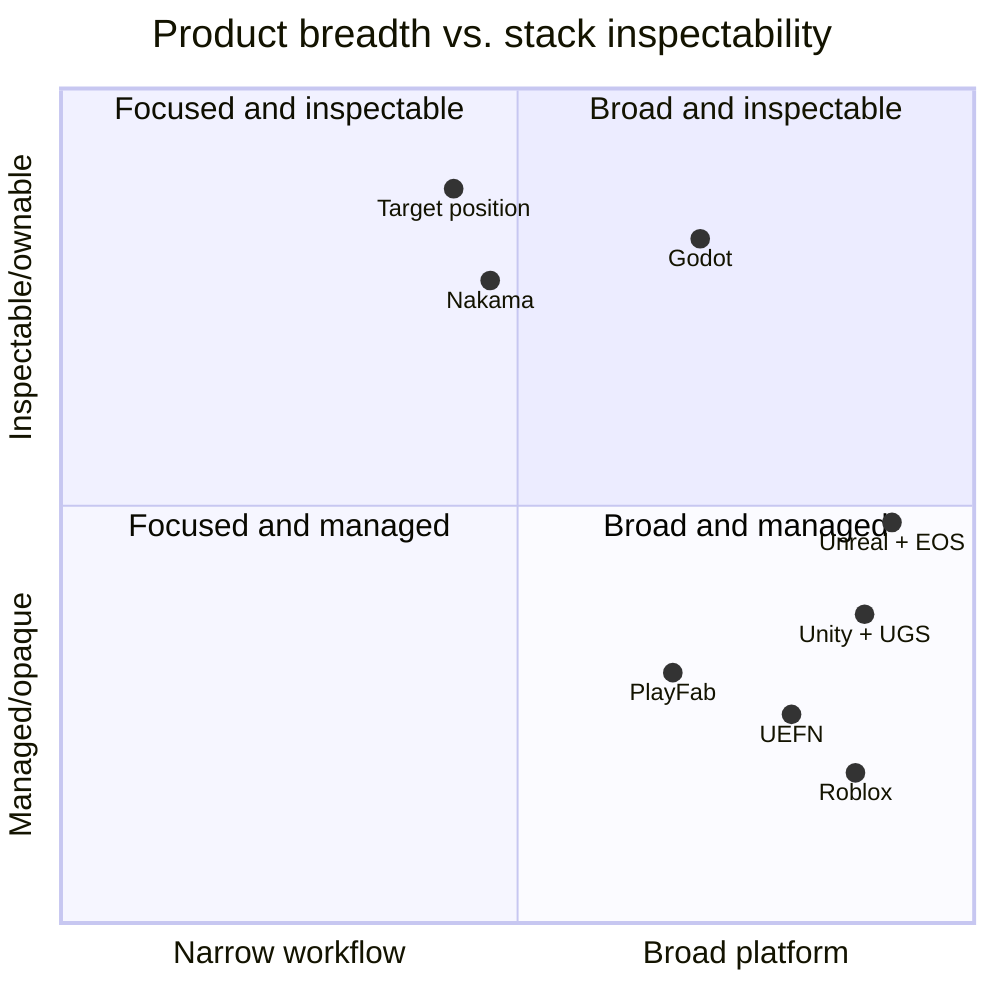

# Competitive Watchlist

**Evidence date:** 2026-07-11
**Review cadence:** monthly pricing/status, quarterly capabilities/positioning, annual
strategy reset
**Purpose:** Learn where to differentiate, where parity is required for trust, and
where integration is more responsible than building.

## How to interpret this document

This project does not yet have external win/loss data. Ratings combine repository
observation with vendor documentation and describe capability relative to the target
user: a serious learner or 2–5 person indie team seeking an inspectable, self-hostable
path from creation to operation.

They are not universal product scores, procurement recommendations, or independent
benchmarks of vendor reliability.

### Rating scale

- **Strong:** deep, credible capability for the compared buyer job.
- **Adequate:** supports the job without being a primary differentiator.
- **Weak:** partial, constrained, prototype, or material friction.
- **Absent:** no supported capability found in the evidence reviewed.
- **Not targeted:** intentionally outside the product's position; not automatically a
  weakness.

### Strategic response scale

- **Differentiate:** invest because it supports the chosen unique position.
- **Reach parity:** meet the minimum required for user trust or workflow completion.
- **Integrate:** use a provider behind an owned seam.
- **Monitor:** watch evidence and define a trigger; do not invest now.
- **Ignore:** explicitly decline the competitive dimension.

## Weighted buyer criteria

Weights are strategic attention, not a mathematical vendor-selection formula.

| Criterion | Weight | Why it matters to the target user |
|---|---:|---|
| Inspectability and learning | 20 | The primary user must understand and change the stack |
| End-to-end workflow continuity | 20 | The chosen differentiation is engine-to-operations connection |
| Local-first/self-hosted ownership | 15 | Learning and indie validation should not require a paid cloud account |
| Time to shareable preview | 10 | Fast feedback is the main activation moment |
| Production safety and operations | 15 | External users require security, recovery, observability, and rollback |
| Runtime/editor capability | 10 | The platform must create credible small games without general parity |
| SDK/integration reach | 5 | Adoption beyond the custom runtime needs stable contracts |
| Distribution/ecosystem | 5 | Valuable later, but premature before the golden path works |

## Landscape map



Positions are qualitative strategic inference, not measured product scores. The
unclaimed target is deliberately narrower than full engines and creator ecosystems,
but more vertically inspectable than managed suites.

---

## Group 1 — General engines and editors

### Evidence snapshot

- Unreal offers source access, high-end engine/editor features, broad target support,
  and a royalty model for games above its revenue threshold. As of the evidence date,
  standard terms list 5% royalty on lifetime gross product revenue above USD 1 million,
  with exclusions. Source: [Unreal licensing](https://www.unrealengine.com/license).
- Unity positions Unity 6 as a 2D/3D engine for 20+ platforms, with a connected cloud
  ecosystem. Unity Personal is free under its eligibility threshold and Pro is a paid
  subscription. Sources: [Unity Engine](https://unity.com/products/unity-engine) and
  [Unity plans](https://unity.com/products).
- Godot is MIT-licensed, open-source, supports 2D/3D and desktop/mobile/Web exports,
  and offers C++ extension paths. Console publishing generally uses third-party
  providers. Sources: [Godot features](https://godotengine.org/features/) and
  [Godot license/FAQ](https://docs.godotengine.org/en/stable/about/faq.html).
- O3DE is an open-source modular 3D engine with a physically based renderer, editor,
  asset workflow, networking, scripting, and component architecture. Source:
  [O3DE features](https://docs.o3de.org/docs/welcome-guide/features-intro/).

### Comparison

| Buyer job | Current project | Unreal | Unity | Godot | O3DE |
|---|---|---|---|---|---|
| Learn core engine algorithms | **Strong** — hand-written and chapter-linked | Adequate — source available, very large system | Weak — product use is easier than core inspection | Strong — open source and documented | Adequate — open but large/complex |
| Production 3D/editor breadth | **Weak** | **Strong** | **Strong** | Adequate/Strong for indie scope | Strong |
| 2D/retro/small deterministic learning | **Strong** | Adequate | Strong | **Strong** | Weak/Adequate |
| Web delivery | Adequate prototype | Weak relative to primary targets | Strong export ecosystem | Adequate with documented constraints | Weak/unclear for target buyer |
| Local/self-hosted ownership | **Strong** | Adequate — source under commercial EULA | Weak/Adequate | **Strong** | **Strong** |
| Integrated Game BaaS | Adequate prototype | Strong via EOS ecosystem, separate services | **Strong** via UGS | Weak via third parties | Weak via third parties |
| End-to-end guidebook to operations | **Strong direction**, incomplete product | Weak for one small inspectable stack | Weak for one inspectable stack | Adequate engine learning, weak BaaS loop | Weak for small end-to-end loop |
| Ecosystem/assets/plugins | **Absent** | **Strong** | **Strong** | Strong and growing | Adequate |

### Implications

- **Differentiate:** teachable end-to-end stack, deterministic reference renderer,
  engine-to-BaaS guidebook, browser feedback loop.
- **Reach parity:** reliable project/resource model, input, animation, audio, packaging,
  profiling, accessibility basics for selected game types.
- **Integrate:** platform SDKs, codecs/import libraries, external store exports.
- **Monitor:** WebGPU/editor architecture in established engines and Godot's growth
  among new indie developers.
- **Ignore:** photoreal AAA renderer and universal importer parity.

### Threat

Godot plus Nakama already offers an open engine/backend combination — and the simple,
well-taught local-to-live workflow this once treated as a *future* risk **already exists
today**: Nakama self-hosts via `docker-compose`, Heroic Labs ships a first-party
`nakama-godot` SDK and a multiplayer bridge over Godot's high-level API, and there are
official end-to-end tutorials. So "open and self-hosted" alone is already not
differentiation. That said, it is **one credible open stack among several**, not the
single biggest threat: Godot's own built-in ENet/WebRTC multiplayer (serverless P2P),
Colyseus, and Supabase-backed hobby stacks contest the same space, and Nakama
self-hosting still carries real Postgres/CockroachDB operational friction. The response
is unchanged: prove smaller scope, deeper explanation, and fewer integration seams for
the chosen games — not to out-feature any one of them.

---

## Group 2 — Managed game services

### Evidence snapshot

- Unity Gaming Services covers authentication, cloud save, economy, cloud code,
  leaderboards, analytics, remote config/A-B testing, content delivery, relay, lobby,
  friends, and voice with free tiers and usage pricing. Source:
  [UGS pricing](https://unity.com/products/gaming-services/pricing).
- PlayFab covers identity, LiveOps, economy/UGC, multiplayer, community, progression,
  and game data. Development Mode has documented caps; paid plans use consumption and
  account tiers. Sources: [PlayFab fundamentals](https://learn.microsoft.com/en-us/xbox/playfab/get-started/),
  [Development Mode](https://learn.microsoft.com/en-us/xbox/playfab/pricing/development-mode),
  and [account plans](https://learn.microsoft.com/en-us/xbox/playfab/pricing/account-upgrades).
- Epic Online Services provides cross-platform account/game services, lobbies,
  sessions, peer connectivity, stats, achievements, player/title data, reports,
  sanctions, analytics, voice, and anti-cheat. Most standard services are free for
  game use under EOS licensing. Sources: [EOS licensing](https://onlineservices.epicgames.com/licensing),
  [EOS FAQ](https://onlineservices.epicgames.com/faq?lang=en-US), and
  [service agreements](https://onlineservices.epicgames.com/services/terms/agreements?lang=en-US).

### Comparison

| Capability | Current project | UGS | PlayFab | EOS |
|---|---|---|---|---|
| Auth/player identity | Adequate prototype | Strong | **Strong** | **Strong** cross-platform |
| Save/config/leaderboard | Adequate prototype | Strong | Strong | Strong data/stats |
| Economy/commerce | Weak inventory operations | Strong | **Strong** | Weak/Adequate relative to peers |
| LiveOps/experiments/analytics | Weak functional slices | Strong | **Strong** | Adequate/Strong |
| Lobby/matchmaking/connectivity | Weak prototype | Strong | Strong | **Strong** cross-platform services |
| Social/trust/voice/anti-cheat | Mostly absent | Strong voice/friends | Strong community ecosystem | **Strong** reports/sanctions/voice/anti-cheat |
| SDK/platform reach | Weak — C++ native/Web | Strong Unity ecosystem | **Strong** multi-platform | **Strong** C/C# and major platforms |
| Self-hosting/data ownership | **Strong direction** | Absent | Absent | Absent |
| Local inspectable implementation | **Strong** | Weak | Weak | Weak |
| Proven global operations | **Absent** | **Strong** | **Strong** | **Strong** vendor-operated |

### Implications

- **Differentiate:** local-first behavior, owned data, readable domain rules, same
  learning model from SDK transport through backend.
- **Reach parity:** API contracts, typed errors, idempotency, roles/audit, migrations,
  recovery, telemetry, stable SDK lifecycle.
- **Integrate:** platform identity, voice, anti-cheat, receipts/payments, global edge.
- **Monitor:** pricing/limits and any self-hosted/local development offerings.
- **Ignore:** claiming equal global scale or enterprise support.

### Nightmare scenario

A managed provider introduces a free local emulator, source-visible domain templates,
simple self-hosted export, and first-class C++/WASM support. The response is not more
services. It is stronger teaching, reference games, resource/publish integration, and
provider portability.

---

## Group 3 — Open/extensible game backends

### Evidence snapshot

- Nakama is open source and self-hostable, with authoritative/relayed multiplayer,
  matchmaking, social/competitive systems, storage, and server customization in Go,
  TypeScript, and Lua. It publishes client libraries for major engines. Source:
  [Nakama](https://heroiclabs.com/nakama/).
- Heroic Labs also positions Hiro for economy/meta systems and Satori for LiveOps,
  segmentation, flags, and experiments. Source: [Heroic game stack](https://heroiclabs.com/).
- Beamable positions engine-native Unity/Unreal SDKs, LiveOps portal, serverless game
  APIs, custom C# logic, commerce/social/content, and private cloud/source licensing.
  Its public pricing page lists a free trial and usage-based API pricing as of the
  evidence date. Sources: [Beamable stack](https://beamable.com/why-beamable/beamable-game-stack),
  [private cloud](https://beamable.com/why-beamable/beamable-private-cloud), and
  [pricing](https://beamable.com/pricing).
- Pragma documents accounts, multiplayer/party/matchmaking/server allocation, social,
  player data, content data, monetization, telemetry, analytics, and operations.
  Source: [Pragma features](https://pragma.gg/docs/0.5.0/introduction/features).

### Comparison

| Capability | Current project | Nakama stack | Beamable | Pragma |
|---|---|---|---|---|
| Source/self-host ownership | **Strong direction**, simple code | **Strong** open source | Adequate/Strong via private offering | Adequate enterprise white-label |
| Backend service breadth | Adequate prototype | **Strong** | **Strong** | **Strong** |
| Authoritative multiplayer | **Absent** | **Strong** | Strong | **Strong** |
| Social/meta/LiveOps | Weak | Strong with stack products | **Strong** | **Strong** |
| Engine-native workflow | Strong only for custom runtime | Strong multi-engine SDKs | **Strong** Unity/Unreal | Strong enterprise integrations |
| Operational maturity | **Weak** | Strong relative to self-hosted category | **Strong** managed/private claims | **Strong** managed platform claims |
| Inspectable teaching path | **Strong** | Adequate product docs/source | Weak/Adequate | Weak for target learner |
| Engine/content/publish integration | **Strong potential**, incomplete | Weak outside backend | Adequate engine integration | Adequate backend/content data |

### Implications

- **Differentiate:** platform-wide learning journey and exact content/build/operations
  lineage.
- **Reach parity:** safe self-host upgrades, SDK/docs, authoritative provider seam,
  social/economy only when reference games use them.
- **Integrate:** allow Nakama or another backend adapter in the long term if users value
  the engine/Studio more than the custom BaaS.
- **Monitor:** Nakama developer experience, Beamable marketplace/AI automation, Pragma
  availability and enterprise-to-indie movement.
- **Ignore:** rebuilding mature authoritative server orchestration before demand.

### Threat

Nakama is the closest backend substitute because it owns the open/self-hosted claim
and has substantially broader SDK and multiplayer maturity. The custom BaaS must be
justified as a teachable reference and tight golden-path component; provider adapters
should remain possible.

---

## Group 4 — Dedicated game-server hosting and orchestration

### Evidence snapshot

- Amazon GameLift Servers provides global managed hosting, autoscaling, Spot/On-Demand
  compute, hybrid/Anywhere capacity, game-session placement, and engine-agnostic SDKs.
  Pricing depends on instances/usage and eligible newer instance generations include
  network bandwidth at no additional charge. Sources:
  [GameLift features](https://aws.amazon.com/gamelift/servers) and
  [GameLift pricing](https://aws.amazon.com/gamelift/servers/pricing/instance-pricing/).
- Edgegap offers on-demand container deployment, matchmaking/server browser, global
  orchestration, and usage pricing. Source: [Edgegap pricing](https://edgegap.com/resources/pricing).
- Agones is an open-source Kubernetes extension for fleets, allocation, autoscaling,
  health, and metrics for dedicated game servers. Source: [Agones overview](https://agones.dev/site/docs/overview/).

### Comparison

| Capability | Current project | GameLift | Edgegap | Agones |
|---|---|---|---|---|
| Dedicated session allocation | **Absent** | **Strong** | **Strong** | **Strong** primitives |
| Global placement/autoscaling | **Absent** | **Strong** | **Strong** | Adequate/Strong, operator-owned |
| Local learning simplicity | **Strong** for in-process/local WS | Weak | Adequate | Weak for Kubernetes beginners |
| Self-host/control | **Strong direction** | Adequate hybrid | Weak/Adequate managed | **Strong** |
| Operating burden | Low only because capability absent | Low/managed | Low/managed | High/operator-owned |
| Cost visibility | Absent | Strong tooling, complex variables | Strong simple published units | Operator responsibility |

### Implications

- **Integrate:** define a provider adapter when a reference game requires authoritative
  session servers.
- **Reach parity:** own game-server protocol, health/readiness/drain semantics,
  allocation intent, session audit, and cost dimensions.
- **Monitor:** provider pricing, regional availability, cold-start, portability, and
  local testing.
- **Ignore:** writing Kubernetes/fleet scheduling, global placement, or DDoS network
  infrastructure.

---

## Group 5 — Creator ecosystems

### Evidence snapshot

- Roblox integrates Studio, hosting, discovery, social systems, economy, analytics,
  safety, and creator payouts. Roblox reported more than USD 1 billion paid through
  DevEx in the twelve months ending June 30, 2025, with more than 29,000 DevEx
  participants and a USD 1,440 median participant payout. Source:
  [Roblox RDC 2025 release](https://ir.roblox.com/news/news-details/2025/Roblox-Unveils-AI-Monetization-and-Performance-Innovations-for-Creators/).
- UEFN/Fortnite combines Unreal-based creation, Fortnite distribution, engagement
  payouts, analytics, discovery, IP programs, and in-island transactions. Epic reported
  260,000 live creator islands, 11.2 billion hours, and USD 722 million paid since UEFN
  launch as of its September 2025 announcement. Source:
  [Fortnite developer ecosystem](https://www.fortnite.com/news/fortnite-developers-will-soon-be-able-to-sell-in-game-items?lang=en-US).

These are vendor-reported ecosystem figures. They show scale and loop completeness,
not typical creator outcomes or an addressable forecast for this project.

### Comparison

| Capability | Current project | Roblox | UEFN/Fortnite |
|---|---|---|---|
| Core implementation learning | **Strong** | Weak/managed platform | Adequate Unreal/Verse learning, platform-managed runtime |
| Authoring breadth/polish | Weak prototype | **Strong** | **Strong** |
| Instant hosting/distribution | **Absent** as product | **Strong** | **Strong** |
| Discovery/community | **Absent** | **Strong** | **Strong** and expanding |
| Economy/payouts | **Absent/Not targeted** | **Strong** | **Strong** |
| Platform ownership/portability | **Strong direction** | Weak ecosystem lock-in | Weak/Adequate ecosystem lock-in |
| Moderation/safety operations | **Absent** | **Strong** investment/operations | **Strong** investment/operations |
| Small transparent full stack | **Strong potential** | Weak | Weak |

### Implications

- **Differentiate:** ownership, portability, inspectability, deterministic assets, and
  external-store exports.
- **Reach parity:** private publish/share loop and creator-facing release analytics.
- **Monitor:** creator onboarding, AI provenance, discovery models, community channels,
  and creator economics.
- **Ignore:** mass-market discovery/payout parity.
- **Conditional:** a curated showcase only after repeat external creation and player
  behavior pass the roadmap gates.

### Nightmare scenario

Creator ecosystems make source-level customization, external export, and self-hosted
backend extensions simple while retaining their distribution advantage. The response
is to narrow further into serious learning/ownership and interoperable reference-game
workflows, not to recreate their economy.

---

## Group 6 — Distribution and hosting substitutes

### Evidence snapshot

- itch.io supports HTML/JavaScript/CSS games packaged for direct browser play, hosts
  their assets, supports fullscreen/embed options, and documents package/size rules.
  Source: [itch.io HTML5 games](https://itch.io/docs/creators/html5).
- Steam distributes native games and provides Steamworks operations. Steam Direct
  requires a USD 100 fee per new app, recoupable after the documented revenue threshold.
  Source: [Steam Direct fee](https://partner.steamgames.com/doc/gettingstarted/appfee).
- Static platforms such as Cloudflare Pages can deploy versioned static output with
  preview deployments and rollback-oriented hosting features. Source:
  [Cloudflare Pages](https://developers.cloudflare.com/pages/).

### Comparison

| Capability | Current project | itch.io | Steam | Static hosting/CDN |
|---|---|---|---|---|
| Browser playable upload | Manual serve | **Strong** | Weak | Strong technical hosting |
| Native distribution | Manual artifacts | Adequate downloads | **Strong** | Weak |
| Discovery/community | **Absent** | Strong indie community | **Strong** store/community | Absent |
| Release/rollback control | **Absent** as product | Adequate creator workflow | Strong branches/tools | Strong deployment primitives |
| Game-specific LiveOps/BaaS | Adequate prototype | Absent | Adequate Steamworks services | Absent |
| Ownership/portability | **Strong direction** | Strong export ownership | Adequate store dependency | Strong technical portability |

### Implications

- **Integrate/export:** itch.io-compatible Web ZIP, generic static deployment, and
  native store-ready packages.
- **Reach parity:** immutable package metadata, release notes, channels, rollback, and
  compatibility checks before upload.
- **Ignore:** building a general storefront.
- **Monitor:** browser package limits, compression/security headers, store policy, and
  platform fee changes.

## Cross-group strategic response matrix

| Capability area | Response | Reason |
|---|---|---|
| Transparent engine/BaaS learning | **Differentiate** | Core mission and uncommon end-to-end combination |
| Project/resource/release lineage | **Differentiate** | Connects existing strengths and reduces black boxes |
| Shareable Web preview | **Differentiate** initially, then parity | Fastest feedback path and strong current architecture fit |
| API contracts/SDK lifecycle | **Reach parity** | Required for trust and external integration |
| Security/migration/backup/observability | **Reach parity** | Required before any production claim |
| General editor/rendering breadth | **Ignore** parity race | Established engines dominate and scope is unbounded |
| Social/voice/anti-cheat | **Integrate** | Specialized, trust-sensitive commodity capability |
| Authoritative server orchestration | **Integrate** | Mature managed/open providers exist |
| Public discovery/catalog | **Monitor** until beta gate | Different product and operating model |
| Payments/creator payouts | **Ignore** until separate commerce gate | Legal, tax, fraud, support, and economics burden |
| AI authoring assistance | **Monitor** and selectively integrate | Useful workflow aid, weak trust position without provenance |

## Unclaimed and crowded positions

### Relatively unclaimed

- a deliberately small, guidebook-driven engine-to-LiveOps implementation;
- local reference adapters paired with documented production provider seams;
- exact lineage from editable resource to player event in an inspectable stack;
- failure labs that teach deployment, migration, tracing, rollback, and restore as
  game-development concepts.

### Crowded

- “all-in-one game platform”;
- “build faster and focus on your game”;
- “scale from one to millions”;
- “AI-powered game creation”;
- “open source and self-hosted” without upgrade/operations evidence;
- “AAA tools for indies.”

Avoid crowded claims unless a measurable proof makes them specific.

## Strategy invalidation signals

Open a strategy review, not merely a feature ticket, if:

1. external users consistently adopt only one layer and reject the integrated stack;
2. Godot/Nakama or another open combination delivers a substantially simpler and
   equally deep learning-to-live path;
3. fewer than three external teams can complete the golden path after two focused
   onboarding iterations;
4. maintaining engine + Studio + BaaS prevents supported-version security fixes;
5. target teams prefer a genre-specific creator tool over a general small-game stack;
6. browser preview provides little activation/feedback value for actual users;
7. operating cost/support makes self-hosted production adapters unsustainable;
8. regulation/platform policy materially changes the feasibility of external player
   data or creator content.

## Monitoring plan

### Monthly — volatile facts

- plan/pricing/free-tier changes for UGS, PlayFab, Beamable, GameLift, and Edgegap;
- material EOS licensing/service status changes;
- browser/WebGPU/WASM compatibility relevant to the supported matrix;
- service deprecations, acquisitions, shutdowns, or security incidents;
- itch.io/Steam packaging and policy changes.

**Owner role:** product owner with release/security owner review when impact is technical.

### Quarterly — capability movement

- Unity/Unreal/Godot project, asset, Web, AI, and collaboration workflow;
- Nakama/Beamable/Pragma local development, SDK, authoritative multiplayer, LiveOps;
- creator ecosystem publishing, analytics, discovery, community, safety, and economics;
- external-user win/loss interviews and support themes;
- whether current response remains Differentiate/Reach parity/Integrate/Monitor/Ignore.

**Owner role:** product owner; relevant domain owner validates technical claims.

### Annually — category and strategy

- target user and buyer jobs;
- market/platform direction and primary distribution targets;
- source/self-host ownership expectations;
- public ecosystem feasibility;
- maintenance capacity and opportunity cost;
- roadmap horizon and stage-gate validity.

**Owner role:** strategy review group/role hats defined in the metrics document.

## Competitive change record

Every material update uses the following fields. This completed baseline example
shows the required level of specificity:

```text
Evidence date: 2026-07-11
Product/group: Unity Gaming Services / managed game services
Primary source: https://unity.com/products/gaming-services/pricing
Observed change: Initial strategy baseline records free tiers plus usage pricing
Fact or vendor claim: Vendor-published capability and price schedule
Affected buyer job: Predict backend cost while moving from prototype to live game
Previous rating/response: No prior strategy baseline
New rating/response: Strong managed breadth; Reach parity for contracts, Integrate selectively
Impact on target users: Raises expectations for transparent meters and free local development
Trigger or stage gate affected: Gate 2 cost allocation and external-beta pricing review
Decision: No roadmap change; monitor monthly for tier and meter changes
Review owner and next date: Product owner, 2026-08-11
```

Future records must include every field and preserve the prior rating/response so
strategy changes remain auditable.

## Source register

### Engines

- [Unreal licensing](https://www.unrealengine.com/license)
- [Unity Engine](https://unity.com/products/unity-engine)
- [Unity plans](https://unity.com/products)
- [Godot features](https://godotengine.org/features/)
- [Godot documentation feature list](https://docs.godotengine.org/en/latest/about/list_of_features.html)
- [O3DE features](https://docs.o3de.org/docs/welcome-guide/features-intro/)

### Game services/backends

- [Unity Gaming Services pricing](https://unity.com/products/gaming-services/pricing)
- [PlayFab fundamentals](https://learn.microsoft.com/en-us/xbox/playfab/get-started/)
- [PlayFab Foundation Mode](https://learn.microsoft.com/en-us/xbox/playfab/get-started/mode-overview)
- [Epic Online Services licensing](https://onlineservices.epicgames.com/licensing)
- [Epic Online Services FAQ](https://onlineservices.epicgames.com/faq?lang=en-US)
- [Nakama](https://heroiclabs.com/nakama/)
- [Heroic game stack](https://heroiclabs.com/)
- [Beamable game stack](https://beamable.com/why-beamable/beamable-game-stack)
- [Beamable pricing](https://beamable.com/pricing)
- [Pragma features](https://pragma.gg/docs/0.5.0/introduction/features)

### Hosting/orchestration

- [Amazon GameLift Servers](https://aws.amazon.com/gamelift/servers)
- [Amazon GameLift pricing](https://aws.amazon.com/gamelift/servers/pricing/instance-pricing/)
- [Edgegap pricing](https://edgegap.com/resources/pricing)
- [Agones overview](https://agones.dev/site/docs/overview/)

### Creator/distribution/Web

- [Roblox RDC 2025 investor release](https://ir.roblox.com/news/news-details/2025/Roblox-Unveils-AI-Monetization-and-Performance-Innovations-for-Creators/)
- [Fortnite creator ecosystem](https://www.fortnite.com/news/fortnite-developers-will-soon-be-able-to-sell-in-game-items?lang=en-US)
- [itch.io HTML5 uploads](https://itch.io/docs/creators/html5)
- [Steam Direct](https://partner.steamgames.com/doc/gettingstarted/appfee)
- [WebGPU major-browser support](https://web.dev/blog/webgpu-supported-major-browsers)
- [WebAssembly feature status](https://webassembly.org/features/)

## Watchlist success condition

The watchlist is useful when it changes a build/integrate/defer decision before the
team spends heavily. It has failed if it becomes a feature checklist, a marketing
battle card that always declares victory, or a collection of links without a trigger
and accountable response.
